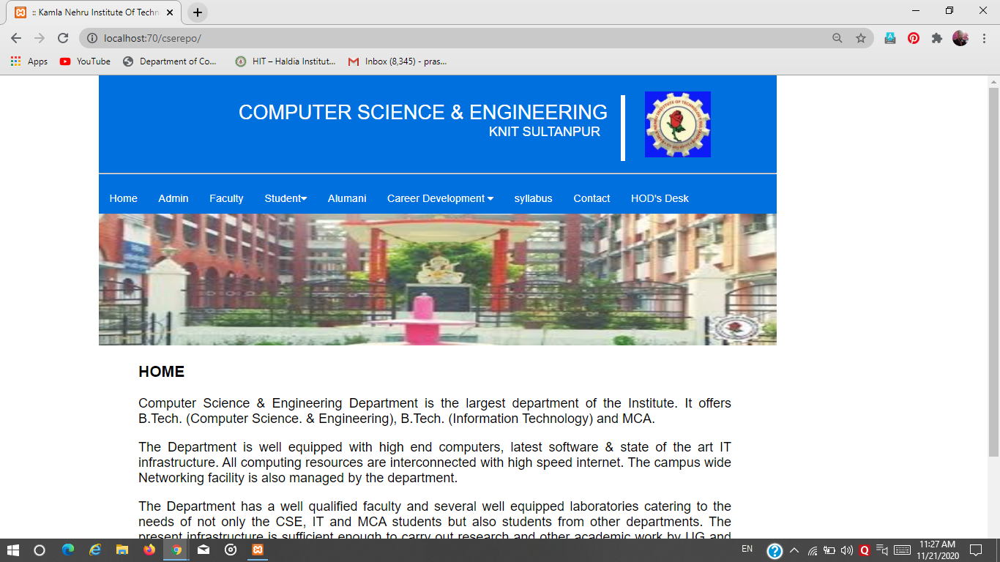
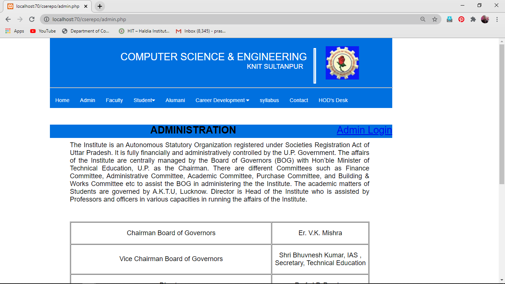
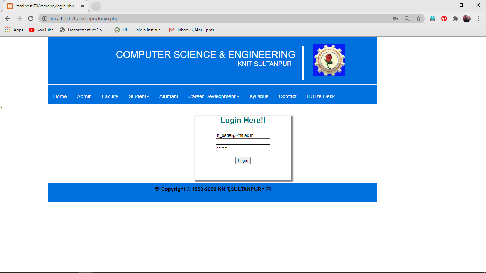
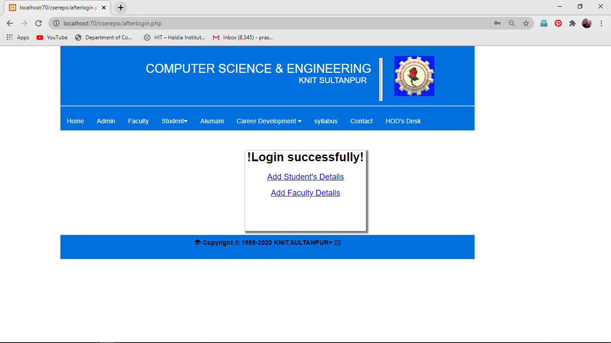
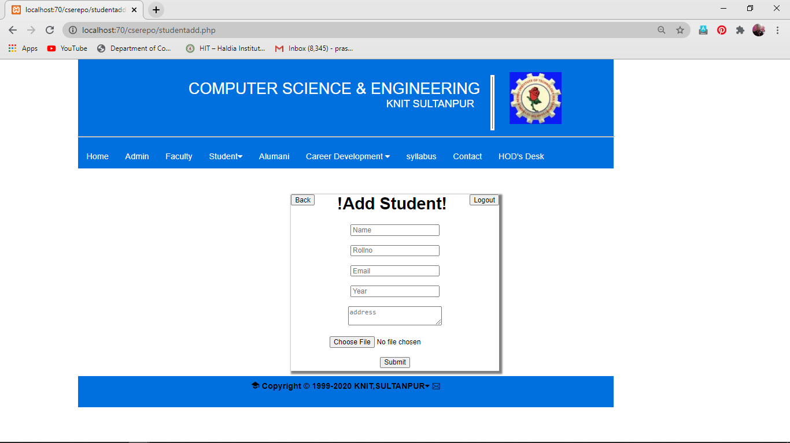
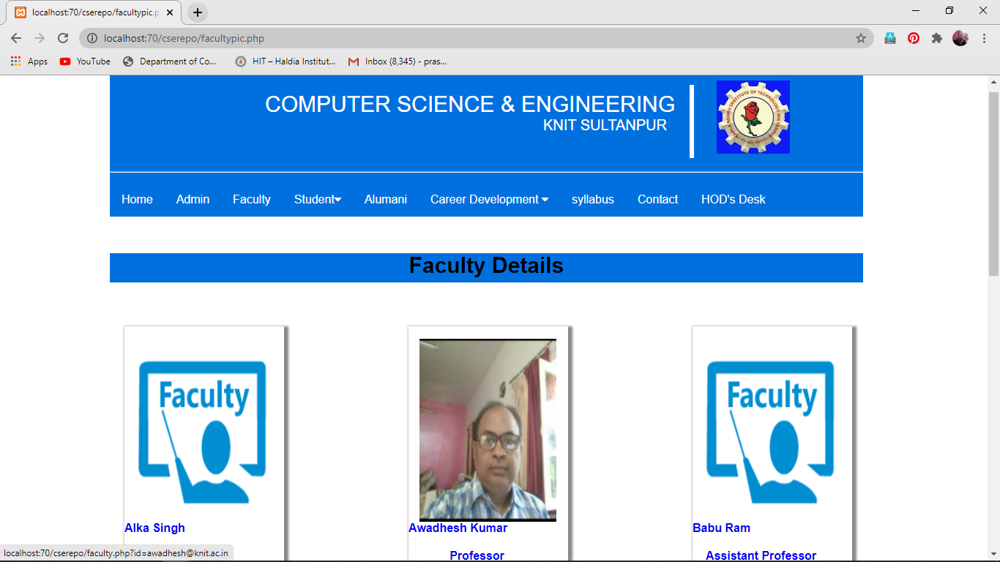
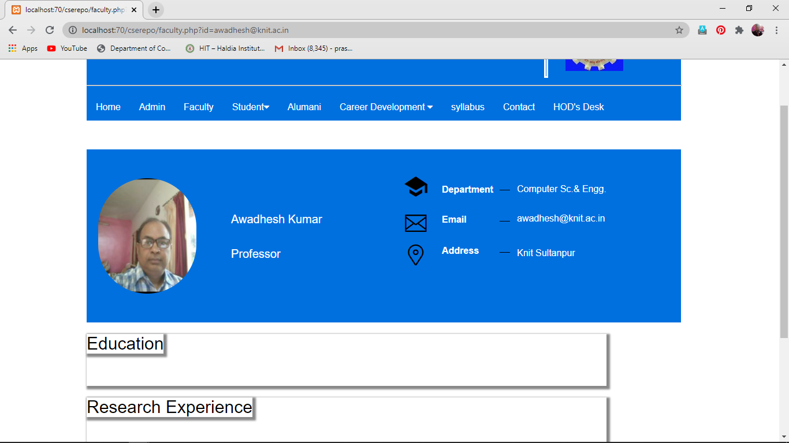
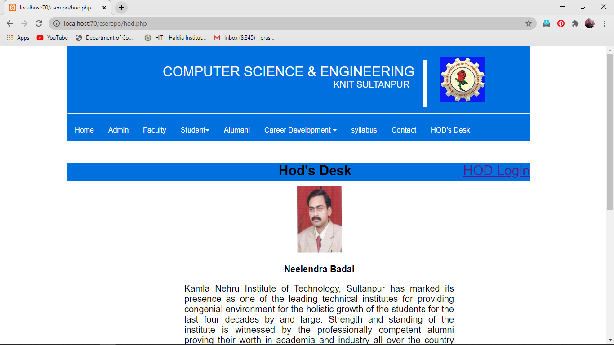
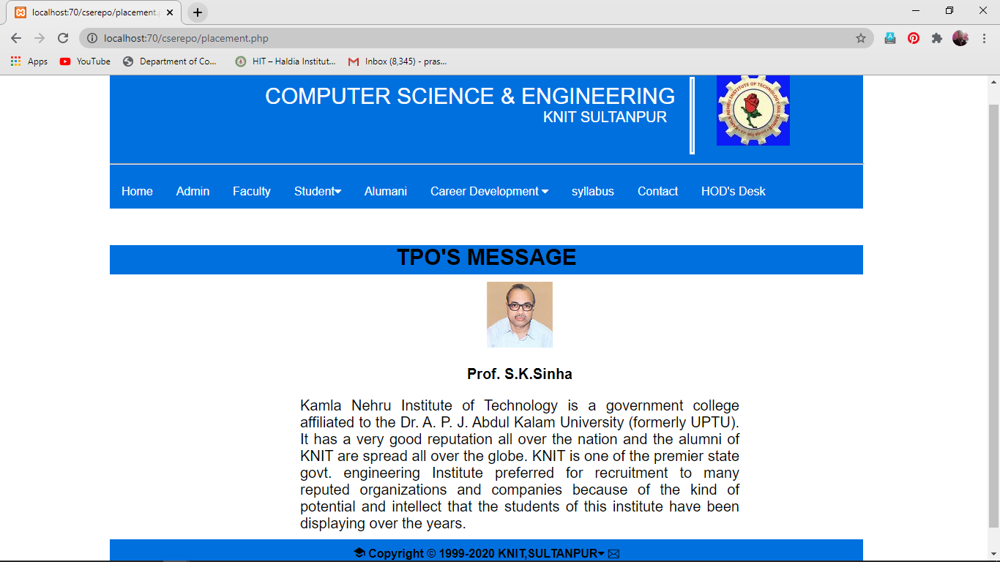

---
# CSE-Departmental-Repository
---
Final Year Project 
---
## Purpose
-----------------------------------------------------------------------------------------------------------------------------------------------------------
The purpose CSE DEPARTMENT REPOSITORY is to allow the administrator of any organization to edit and find out the personal details of a student and allows the student to keep up to date his profile .It’ll also facilitate keeping all the records of students, such as their id, name, mailing address, phone number, DOB etc. So all the information about a student will be available in a few seconds.Overall, it’ll make Student Information Management an easier job for the administrator and the student of any organization.

---
## Configurations 

--> Start

--> install Xampp for Windows and lampp for linux

--> download project and save whole directory to htdocs directory in xammp directory

--> Go to database Folder and Check the updated_db.sql file

--> open Xampp Create database "uploadfile"

--> now import "updated_db.sql"

--> done

## Screenshots
---
### Home Page

### Administration Page

### Admin Login Page

### After Login Page

### Student Registration Page

### Student show Page

### Faculty Show Page

### Faculty Additional Details

### HOD Desk

### TPO Desk Page

